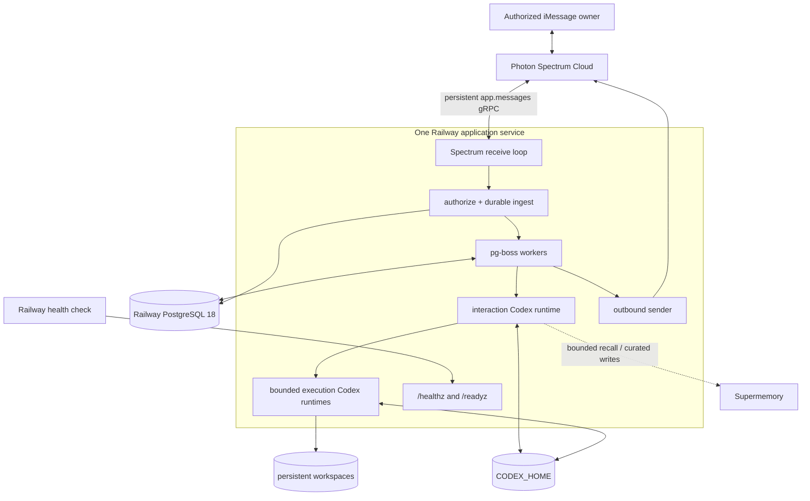
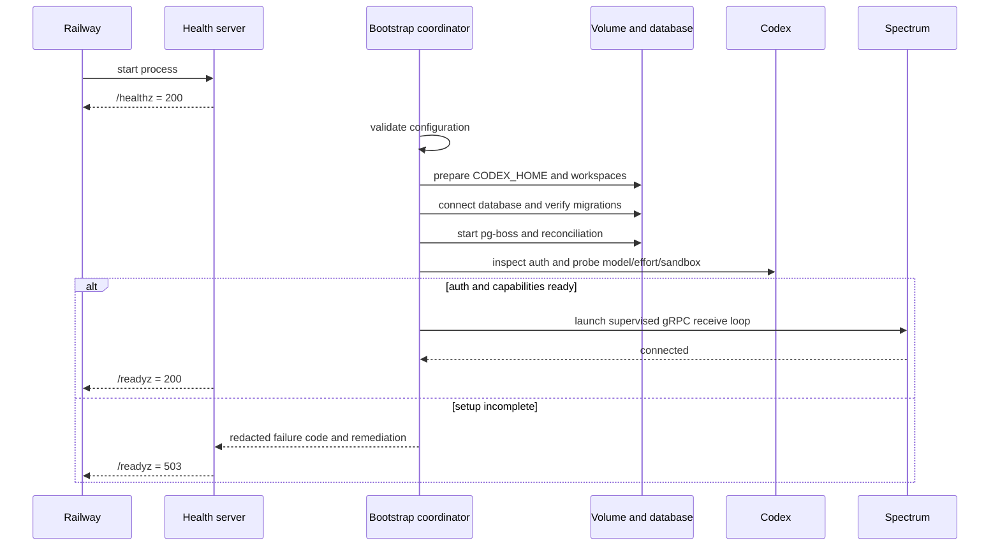
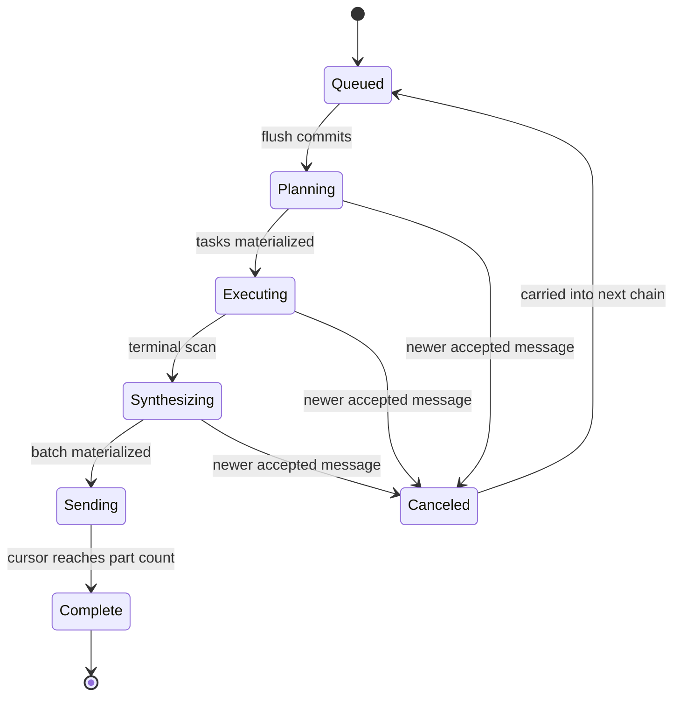

# Architecture

## 1. Status and integration boundary

The target is one long-running Node.js service with three concurrent responsibilities:

1. consume iMessage events from Spectrum Cloud’s persistent `app.messages` gRPC stream;
2. run the durable inbound, Codex, outbound, and memory jobs backed by PostgreSQL/pg-boss; and
3. expose liveness and readiness endpoints to Railway.

The branch composes the provider, database, queue, Codex, memory, storage, health, and shutdown modules into that topology. `src/index.ts` exposes `startAgentService()` and an injected `AgentServiceBootstrap`; `src/runtime/production-bootstrap.ts` supplies the production adapters; and `src/server.ts`, used by `npm run dev` and `npm start`, starts the composed lifecycle.

This distinction is an intentional release boundary:

| Layer | Current branch |
|---|---|
| Railway service configuration | Present in `railway.json`; project resources are configured in Railway |
| Persistent storage preparation | Composed as an injectable startup stage |
| Full health/readiness server | Used by `src/server.ts`; reports the composed operational stages |
| Boot and graceful-shutdown ordering | Implemented as an injectable composition boundary |
| Spectrum, PostgreSQL, Codex, and Supermemory modules | Implemented and fake/unit/integration-testable in isolation |
| Authorized receive through plan/execute/synthesize/send | Composed into the executable entrypoint; protected live path untested |
| Clean local and Railway first-message evidence | Not established |
| Live Photon, Codex, Railway, or Supermemory evidence | Not run for this release |

The remainder of this document describes the composition contract and identifies where implementation evidence stops.

## 2. Deployed topology



The final Railway project deliberately uses:

- one application service with one replica;
- one PostgreSQL 18 service connected with `DATABASE_URL=${{Postgres.DATABASE_URL}}`;
- one volume mounted at `/var/data`;
- `CODEX_HOME=/var/data/codex` and `AGENT_WORKSPACE_ROOT=/var/data/workspaces`;
- a pre-deploy `npm run db:migrate`; and
- zero deployment overlap with a 90-second draining window.

The volume-backed design makes v1 single-instance. PostgreSQL is independently durable and remains the operational source of truth. The volume is for Codex credentials/session files and workspaces, not queue truth.

## 3. Ownership and trust boundaries

```text
PostgreSQL                              Persistent volume
------------------------------------    ---------------------------------
Accepted inbound/outbound content       CODEX_HOME config/auth/sessions
Sender and space routing                Agent workspaces and artifacts
Chains, tasks, versions, cancellation
Approvals and failure events             Supermemory
Outbound parts and send cursor           ---------------------------------
Codex thread IDs and summaries           Curated durable facts/summaries
Memory operation receipts                Bounded semantic recall
```

These boundaries are non-interchangeable:

- PostgreSQL is required for authorization state, queueing, idempotency, delivery, and recovery.
- Supermemory is optional at turn time and cannot authorize, approve, route, or acknowledge a message.
- `CODEX_HOME` contains private credentials and must use file-backed storage with directory mode `0700` and config/auth mode `0600` where supported.
- `AGENT_WORKSPACE_ROOT` must be an absolute path separate from and non-overlapping with `CODEX_HOME`.
- Unknown senders must be rejected before any model or child-process call.
- Model, repository, memory, web, and tool content are untrusted data. A model cannot broaden its permission profile or approve an action.

## 4. Boot sequence

The final composition boundary starts the HTTP listener first so the process can remain live while setup is incomplete.



The ordered startup stages in `startAgentService()` are:

1. listen on HTTP;
2. validate configuration;
3. prepare the two persistent directories and Codex config;
4. connect PostgreSQL;
5. apply or verify migrations;
6. start pg-boss;
7. inspect Codex auth and probe configured capabilities;
8. configure optional Supermemory; and
9. start Spectrum only when Codex auth and capabilities are ready.

The integration bootstrap must make `startSpectrum()` resolve after supervision has been launched and connection state can be tracked; it must not block bootstrap completion for the lifetime of the stream. It must also run durable-pipeline reconciliation before accepting normal work.

Missing or expired ChatGPT auth is a setup state, not a crash loop. Liveness remains healthy, readiness stays false, and Spectrum execution is not started. In ChatGPT mode the operator runs `npm run codex:login` and `npm run codex:status` using the same persistent `CODEX_HOME`, then restarts. In API-key mode readiness requires `OPENAI_API_KEY`; the key is copied only into the explicit Codex child environment.

## 5. Message pipeline

### 5.1 Receive

The Spectrum loop consumes native provider values:

```ts
for await (const [space, message] of app.messages) {
  // narrow, authorize, persist, and enqueue only
}
```

The loop ignores non-iMessage events, outbound echoes, unsupported content, and invalid sender/space values. An injected `authorizeAndIngest()` boundary must deterministically authorize the normalized sender before durable ingest. Codex and Supermemory never run inline in the receive loop.

### 5.2 Persist and debounce

For each accepted text:

1. insert the message under a unique provider message ID;
2. preserve Spectrum space GUID and route phone for restart lookup;
3. supersede the active interruptible chain when appropriate; and
4. upsert the per-space `inbound.flush` job for the debounce deadline.

If queue scheduling fails after insert, the message remains durable. Reconciliation finds spaces with undrained input and re-creates the singleton flush.

### 5.3 Flush

The flush transaction drains undrained and carried messages in order, creates a versioned chain, cancels the stale chain, and enqueues one `turn.plan` job. Queue payloads contain identifiers and expected versions/states, not raw personal content.

### 5.4 Plan

The `turn.plan` handler:

1. verify the chain ID, version, and current state;
2. load authoritative history from PostgreSQL;
3. optionally recall bounded, owner-scoped Supermemory context;
4. resolve an exact model/effort profile;
5. run the interaction Codex thread with structured output; and
6. either materialize a direct response or enqueue bounded execution tasks.

The production composition registers this handler with its model profiles, prompt bundle, durable repositories, queue publisher, optional memory recall, and outbound status transport. Offline tests cover those boundaries; protected live-provider execution remains a separate release check.

### 5.5 Execute

Each `task.execute` handler re-checks chain/task state and current workspace capability, resolves a named thread and explicit workspace, creates a minimal child environment, applies a code-owned permission profile, runs with timeout/cancellation/output bounds, validates `ExecutionResult`, and persists a terminal task result or exact approval proposal.

Execution agents cannot message the owner or consume their own approval. Their results return through synthesis. The production composition registers the durable execution worker with bounded concurrency, cancellation, model routing, prompts, and the shared orchestration repository.

### 5.6 Synthesize

The singleton `turn.synthesize` handler loads terminal task results, preserves truthful partial failures, requires confirmation for consequential operations, produces the final user-facing response, and materializes every outbound part before sending. The production composition registers this worker and the outbound sender against the same durable repository and queue.

### 5.7 Send

`outbound.send` rehydrates the native Spectrum space using its stored GUID and route phone, claims the next materialized part, sends it with a stable client GUID, and advances the database cursor only after acknowledgement.

```ts
clientGuid = sha256(`${deploymentId}:${outboundBatchId}:${position}`)
```

A crash after provider acknowledgement but before cursor persistence retries the same GUID. The transport receives the same idempotency key while PostgreSQL remains authoritative about the next part.

### 5.8 Memory projection

Memory curation runs only after a successful turn. It filters temporary, low-confidence, or secret-like candidates; hashes content for deduplication; namespaces by internal deployment/owner IDs; writes through a bounded provider client; and records receipts in PostgreSQL. Failure does not change the already completed operational response.

## 6. Supersession and cancellation

People send corrections in fragments. Debounce is per space, and a later message can supersede an already drained chain.



Handlers compare their expected version and state with the authoritative row. A stale cancellation timestamp cannot cancel a later chain. Canceled messages are carried forward, and a canceled chain cannot synthesize, send, or consume an approval.

## 7. Interaction, execution, and security lanes

The interaction lane owns concise user-facing answers, decomposition, status wording, approvals, and final synthesis. Its default permissions are read-only with network disabled.

Execution lanes receive one bounded purpose, one explicit workspace, a model profile, a permission profile, runtime/output limits, and only relevant context. Independent tasks may run concurrently within the configured global limit; dependent tasks form a validated DAG.

The Codex child environment is constructed from an allowlist. It excludes database, Photon, Supermemory, encryption, and unrelated cloud credentials. `OPENAI_API_KEY` is included only in explicit API-key mode. `danger-full-access` is forbidden.

Consequential actions use immutable approval data bound to owner, allowed space, task, normalized payload hash, expiration, and one-time consumption. Model text is never proof of approval.

## 8. Health and readiness

The composed health server returns:

```text
GET /          -> 200 operator setup/readiness page; never the iMessage conversation
GET /healthz  -> 200 {"status":"ok"}
GET /readyz   -> 200 only when every critical component is ready
GET /readyz   -> 503 with redacted component states and safe actions otherwise
```

Critical readiness components are configuration, database, migrations, queue, Spectrum, Codex auth, Codex capabilities, persistent storage (`disk` in the readiness contract), and workspace. Supermemory may be `disabled` or degraded without making operational readiness depend on semantic storage.

Example setup response:

```json
{
  "status": "not_ready",
  "ready": false,
  "shuttingDown": false,
  "components": {
    "configuration": { "state": "ok" },
    "database": { "state": "ok" },
    "migrations": { "state": "ok" },
    "queue": { "state": "ok" },
    "spectrum": { "state": "missing" },
    "codexAuth": { "state": "missing", "code": "CODEX_AUTH_MISSING" },
    "codexCapabilities": { "state": "unknown" },
    "disk": { "state": "ok" },
    "workspace": { "state": "ok" },
    "supermemory": { "state": "disabled" }
  },
  "actions": [
    "Run npm run codex:login in the private service shell, verify with npm run codex:status, then restart the service."
  ]
}
```

Raw provider errors, credentials, handles, message content, and unrestricted paths never enter readiness. The root operator page renders only this redacted state and safe setup actions. Railway uses `/healthz` to avoid turning incomplete private enrollment into a restart loop. Operators use `/readyz` as the acceptance gate.

The current `src/server.ts` starts this health server first, runs each operational stage, and shuts the composition down on process signals. Its `/healthz` proves only that the HTTP process is alive; `/readyz` becomes `200` only after PostgreSQL, migrations, queue, Codex auth/capabilities, storage, and Spectrum are ready.

## 9. Failure and recovery contract

| Failure point | Required recovery | Current evidence boundary |
|---|---|---|
| Receive: after DB insert, before debounce schedule | Reconciliation re-creates `inbound.flush`; provider duplicate remains harmless | Durable-pipeline fake coverage; final receive composition/live replay untested |
| Debounce | Messages remain undrained and the per-space singleton can be upserted again | Queue singleton and PostgreSQL pipeline coverage |
| Planning | Versioned singleton retries or cancellation; no stale batch | Handler/repository fake and offline integration coverage; production composition/live path untested |
| Execution | Abort superseded Codex work; bounded retry/failure persists | Handler, repository, Codex cancellation, and recovery fake coverage; production composition/live path untested |
| Synthesis | Terminal scan enqueues one singleton synthesis; partial failure is preserved | Handler/repository fake and offline integration coverage; production composition/live path untested |
| Each outbound part | Resume at persisted cursor and retain the same logical client GUID | Fake crash at each materialized part; Spectrum 12.7 cannot receive the caller GUID, so a post-send/pre-checkpoint crash can duplicate one bubble |
| Memory write | Operational response stays complete; receipt records failure and job may retry | Expected contract; outage validation intentionally skipped by user direction in this release work |
| Spectrum disconnect | Readiness degrades; supervised loop reconnects with bounded exponential backoff | Message-loop fake coverage; live disconnect/replay untested |
| PostgreSQL timeout | Readiness false; do not begin untracked model work; resume durable jobs after recovery | Composed boot-time timeout/readiness coverage; runtime post-start database health transition is not implemented or tested |
| Supermemory timeout | Recall returns degraded/empty context; turn may continue; write retries independently | Expected contract; timeout/outage validation intentionally skipped by user direction in this release work |
| Expired Codex authentication | Readiness false; pause execution; re-enroll or replace key and re-probe | Capability/readiness fakes; live expiration untested |

The executable bootstrap calls reconciliation before opening inbound acceptance, and every handler re-checks authoritative state. This offline evidence does not prove the final cross-provider path or provider-side deduplication.

Supermemory timeout/outage behavior is included here as the intended operational contract. It was not validated in this release work because the user explicitly directed that testing to be skipped.

### Persistent volume loss

1. Keep the service not ready.
2. Recreate `CODEX_HOME` and workspaces with private permissions.
3. Re-enroll ChatGPT or restore the configured API-key secret.
4. Recreate workspaces from reviewed Git remotes or backups.
5. Start new Codex threads using bounded summaries and thread IDs stored in PostgreSQL.
6. Do not alter database-backed messages, approvals, cursors, or memory receipts.

### Corrupt or missing Codex session

Mark only the affected thread reset, preserve its PostgreSQL summary, and create a replacement thread with that summary. Never delete unrelated owner memory, agent sessions, or workspaces as a blanket recovery step.

### Rollback

Database migrations are forward-compatible release artifacts. Roll back only to an application revision documented as compatible with the current schema. Preserve PostgreSQL, pg-boss state, the persistent volume, and outbound cursors. If compatibility is uncertain, ship a forward fix rather than attempting an improvised down migration.

## 10. Graceful shutdown

On `SIGTERM` or `SIGINT` the coordinator:

1. sets readiness false and marks shutdown in progress;
2. aborts the shared signal used by active work;
3. stops Spectrum;
4. stops Codex work;
5. gives outbound delivery a bounded checkpoint opportunity;
6. stops pg-boss;
7. closes PostgreSQL; and
8. closes the health listener last.

Each hook has a timeout. Cleanup continues after a hook fails, and results contain bounded failure codes rather than raw exception text. A critical failure sets a nonzero exit status.

## 11. Extension points

Extension points are explicit dependency-injection boundaries, not speculative provider frameworks:

| Boundary | Intended extension |
|---|---|
| `AgentServiceBootstrap` | `production-bootstrap.ts` supplies config, storage, DB, queue, Codex, memory, and Spectrum lifecycle adapters |
| `AuthorizeAndIngest` | Deterministic allowlist/group policy followed by durable ingest |
| `StructuredCodexRunner` | Real pinned Codex SDK runtime or deterministic test fake |
| `OutboundTransport` | Native Spectrum space rehydration/send adapter or test fake |
| `SupermemoryPort` | Pinned Supermemory client or isolated test fake |
| Repository/queue interfaces | PostgreSQL-backed handlers with transaction and version invariants |

Native Spectrum `Space`, `Message`, provider narrowing, `space.send`, and `space.get` concepts remain visible. Do not introduce a second generic messaging SDK.

Bounded product extensions can add attachment normalization, additional slash commands, new curated-memory kinds, or new permission profiles after their schemas, security policy, recovery behavior, and provider tests are defined. A public multi-tenant service, alternate operational database, or horizontal Codex worker pool is a separate architecture decision.

## 12. Scaling path

The current volume and private-auth design cannot safely run multiple application service instances. Before horizontal scaling:

- move credentials to a supported per-worker/enterprise secret mechanism;
- move or explicitly shard workspaces onto durable per-worker storage;
- partition receive and execution ownership by deployment/owner;
- preserve PostgreSQL queue, chain-version, approval, stable-GUID, and cursor contracts; and
- prove failover and duplicate-delivery behavior with the live provider.

The starter intentionally does not pre-build this distributed topology.

## 13. Release evidence boundary

Automated tests may verify deterministic module behavior with fakes and, when configured, a disposable PostgreSQL database. They do not establish that Railway provisioned a clean account, Photon delivered/replayed a real event, Codex authenticated/resumed a live thread, or Supermemory persisted/deleted a live memory.

The executable production runtime is composed. Release acceptance still requires the protected E2E, chaos, rollback, restart, and clean-room documentation exercises in [TEST_PLAN.md](./maintainers/TEST_PLAN.md). Until those are recorded, describe the provider paths as designed or locally simulated—not live-working.
